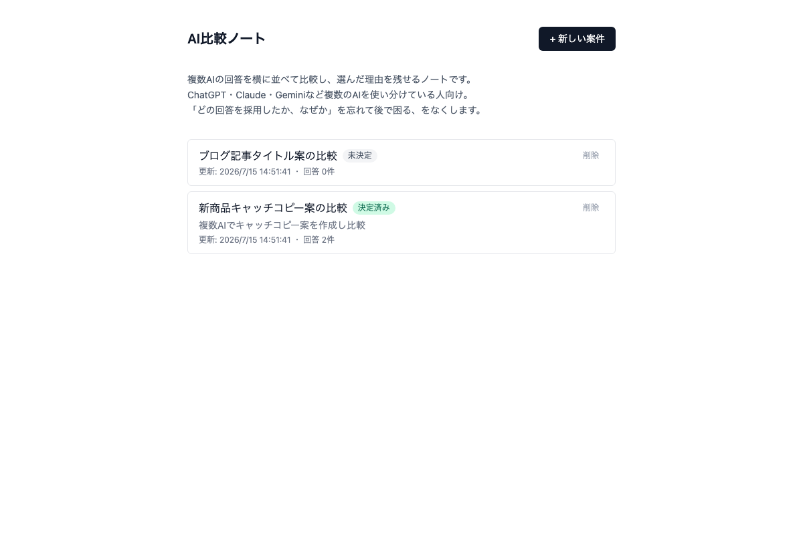
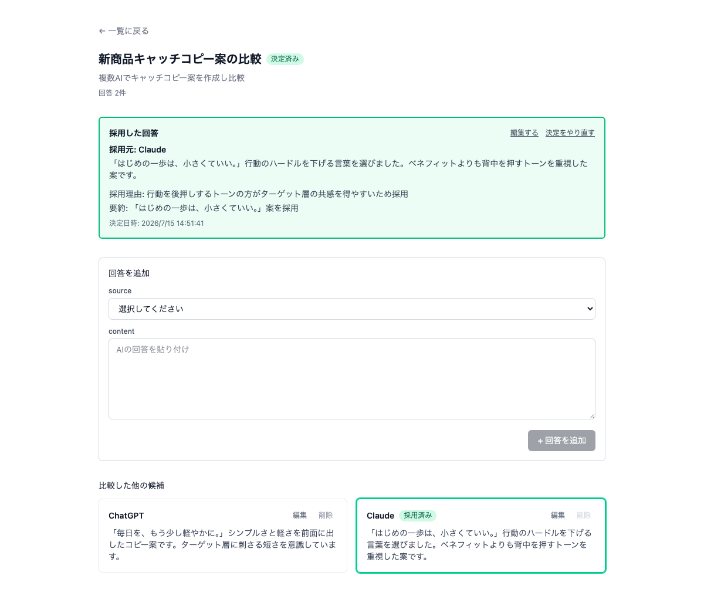

# AI比較ノート(compare-note)

複数AIの回答を横に並べて比較し、選んだ理由を残せるノートです。
ChatGPT・Claude・Geminiなど複数のAIを使い分けている人向け。
「どの回答を採用したか、なぜか」を忘れて後で困る、をなくします。

バックエンドなし、データはブラウザのlocalStorageのみに保存されるローカルWebアプリです。

## スクリーンショット

案件一覧(未決定/決定済みが一目でわかる):



案件詳細(複数AIの回答を比較し、採用理由を記録):



## 使い方

1. 「+ 新しい案件」からタイトル(必須)とcontext(任意)を入力して案件を作成する
2. 案件詳細画面で、AIの回答をsource(ChatGPT/Claude/Gemini/Copilot/Perplexity/Other)を選んで貼り付ける。2件以上貼り付けると横並びで比較できる
3. 採用したい回答にラジオボタンでチェックし、採用理由(必須)と要約(任意)を入力して「決定を保存」
4. 決定内容は画面最上部にサマリーカードとして表示される。案件一覧に戻ると「決定済み」バッジが付き、いつ再訪しても採用元・理由をすぐ思い出せる

データはブラウザ単位で保存されるため、PCとスマホ、別のブラウザでは共有されません。キャッシュ削除やシークレットモードでは消えます。エクスポート・バックアップ機能は現時点ではありません。

## セットアップ

```bash
npm install
```

## 開発

```bash
npm run dev      # 開発サーバー起動(http://localhost:5173)
npm run test     # ユニットテスト(vitest)
npm run build    # 型チェック + 本番ビルド
npm run lint     # ESLint
npm run preview  # ビルド後のプレビュー
```

## 技術構成

- React + TypeScript + Vite + Tailwind CSS
- 状態管理: なし(useStateのみ)。ルーティングライブラリは使わず、画面切り替えは`App.tsx`のstateで行う
- データ: localStorage(キー: `compare-note:v1`)。バックエンド・APIサーバー・認証なし
- テスト: Vitest + jsdom + @testing-library/react(画面テスト、計78件)
- ホスティング: Vercel(静的配信、環境変数不要)

## 現在の実装範囲

- 画面1(案件一覧): 新規案件作成フォーム(タイトル必須・context任意)、更新日・回答件数・決定状態バッジ付きのカード表示(updatedAt降順)、削除(確認あり)、空状態
- 画面2(案件詳細)状態A(未決定): 候補回答の追加フォーム(source選択+content貼り付け)、レスポンシブな比較表示(2件はグリッド、3件以上は横スクロール、モバイルは1列)、各回答の編集・削除、各候補への採用選択(ラジオボタン)
- 画面2(案件詳細)状態B(決定済み): 決定の記録(採用candidate・採用理由reason必須・decisionSummary任意)、決定サマリーカード、「編集する」「決定をやり直す」。採用済みの候補は削除不可

詳細な設計判断は[docs/](./docs/)の仕様書、進捗の詳細は[PROJECT_STATUS.md](./PROJECT_STATUS.md)・[resume.md](./resume.md)を参照。

- [issue-001_mvp_spec.md](./docs/issue-001_mvp_spec.md) — 何を作るか・何を作らないか
- [issue-001_user_flow.md](./docs/issue-001_user_flow.md) — 画面遷移・状態設計
- [issue-001_data_schema.md](./docs/issue-001_data_schema.md) — データ構造
- [issue-001_7day_plan.md](./docs/issue-001_7day_plan.md) — Day1〜7の実装計画
- [day5_dogfooding_report.md](./docs/day5_dogfooding_report.md) — 実案件3件でのDogfooding結果(Day5)
- [day5_improvement_backlog.md](./docs/day5_improvement_backlog.md) — 改善候補(Must/Should/Do Not Fix、Day5時点)
- [day7_light_validation.md](./docs/day7_light_validation.md) — 実案件3件でのDogfooding結果(Day7、Day5とは別の3案件)
- [competitive_analysis.md](./docs/competitive_analysis.md) — Notion/Obsidian/Apple Notes/VS Code Markdown/Google Docsとの競合比較
- [ai_design_review.md](./docs/ai_design_review.md) — PM/UX/個人開発者/SaaS創業者/投資家5視点でのレビューと判定・改善案(Must/Should/Could/Won't)
- [CHANGELOG.md](./CHANGELOG.md) — リリースノート

## 今後の予定

Day7の軽量検証(Light Validation)の結果、判定は**Improve**(このまま初期10人への案内には進まず、Must Fix 2件を先に対応してから進める)。詳細は[ai_design_review.md](./docs/ai_design_review.md)を参照。

- **Must Fix(案内前に対応)**: sourceプリセットに「Claude Code」を追加(SF-1、Day5の50%→Day7の100%で発生し悪化)。`exportData`/`importData`(実装・テスト済みだがUI未接続)をエクスポート/インポートボタンとして案件一覧に配線する
- Must Fix完了後に、初期10人への案内・フィードバック収集([docs/issue-001_launch_plan.md](./docs/issue-001_launch_plan.md))に進む
- Should Fix: 「回答を追加」フォームの位置見直し(SF-2)
- 課金導線は現時点で未実装。無料版での利用実績(案件数・決定記録の完了率・継続利用)を見てから検討する([issue-001_launch_plan.md](./docs/issue-001_launch_plan.md))

## データの保存について

このアプリのデータはブラウザ単位で保存されます。同じ人でもPCとスマホ、別のブラウザでは共有されません。キャッシュ削除・シークレットモードでは消えます。詳細は[docs/issue-001_data_schema.md](./docs/issue-001_data_schema.md)を参照。
